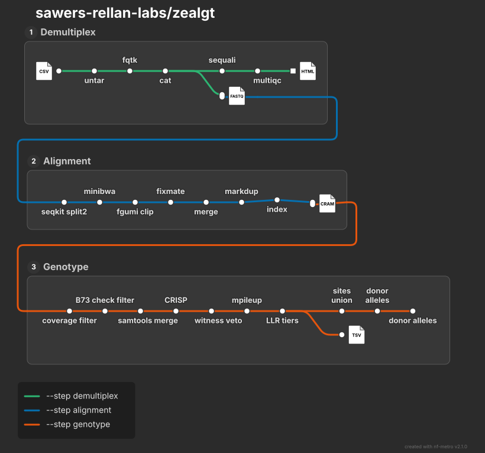

# sawers-rellan-labs/zealgt

## Introduction

**sawers-rellan-labs/zealgt** takes the ZEAL maize samples from raw sequencing lanes to aligned CRAMs, one run per step chosen with `--step demultiplex | alignment`:



Every step, CRAM QC included: [full map](docs/images/zealgt_metro_full.svg) and [`docs/structure.md`](docs/structure.md).

- `--step demultiplex` reads the library lanes listed in `meta/samples.csv`, extracts each lane's reads (`EXTRACT_LANE`, for batch-1 tar members), demultiplexes them per lane by barcode (`FQTK`) and joins each sample's lanes (`CAT_FASTQ`), writing `fastq/<sample>/` and `fastq/samplesheet.csv`.
- `--step alignment` reads `fastq/samplesheet.csv` and aligns each sample with `minibwa`, soft-clips bases that run past the mate (`fgumi clip`), then fixes mates, sorts, marks duplicates and indexes with `samtools`, writing one CRAM per sample; `samtools stats`, Picard `CollectWgsMetrics` and `mosdepth` feed a `MultiQC` report.

## Usage

> [!NOTE]
> If you are new to Nextflow and nf-core, please refer to [this page](https://nf-co.re/docs/get_started/environment_setup/overview) on how to set-up Nextflow. Make sure to [test your setup](https://nf-co.re/docs/get_started/run-your-first-pipeline) with `-profile test` before running the workflow on actual data.

<!-- TODO nf-core: Describe the minimum required steps to execute the pipeline, e.g. how to prepare samplesheets.
     Explain what rows and columns represent. For instance (please edit as appropriate):

First, prepare a samplesheet with your input data that looks as follows:

`samplesheet.csv`:

```csv
sample,fastq_1,fastq_2
CONTROL_REP1,AEG588A1_S1_L002_R1_001.fastq.gz,AEG588A1_S1_L002_R2_001.fastq.gz
```

Each row represents a fastq file (single-end) or a pair of fastq files (paired end).

-->

Now, you can run the pipeline using:

<!-- TODO nf-core: update the following command to include all required parameters for a minimal example -->

```bash
nextflow run sawers-rellan-labs/zealgt \
   -profile <docker/singularity/.../institute> \
   --input samplesheet.csv \
   --outdir <OUTDIR>
```

> [!WARNING]
> Please provide pipeline parameters via the CLI or Nextflow `-params-file` option. Custom config files including those provided by the `-c` Nextflow option can be used to provide any configuration _**except for parameters**_; see [docs](https://nf-co.re/docs/running/run-pipelines#using-parameter-files).

## Credits

sawers-rellan-labs/zealgt was originally written by Fausto Rodriguez Zapata.

We thank the following people for their extensive assistance in the development of this pipeline:

<!-- TODO nf-core: If applicable, make list of people who have also contributed -->

## Contributions and Support

If you would like to contribute to this pipeline, please see the [contributing guidelines](docs/CONTRIBUTING.md).

## Citations

<!-- TODO nf-core: Add citation for pipeline after first release. Uncomment lines below and update Zenodo doi and badge at the top of this file. -->
<!-- If you use sawers-rellan-labs/zealgt for your analysis, please cite it using the following doi: [10.5281/zenodo.XXXXXX](https://doi.org/10.5281/zenodo.XXXXXX) -->

<!-- TODO nf-core: Add bibliography of tools and data used in your pipeline -->

An extensive list of references for the tools used by the pipeline can be found in the [`CITATIONS.md`](CITATIONS.md) file.

This pipeline uses code and infrastructure developed and maintained by the [nf-core](https://nf-co.re) community, reused here under the [MIT license](https://github.com/nf-core/tools/blob/main/LICENSE).

> **The nf-core framework for community-curated bioinformatics pipelines.**
>
> Philip Ewels, Alexander Peltzer, Sven Fillinger, Harshil Patel, Johannes Alneberg, Andreas Wilm, Maxime Ulysse Garcia, Paolo Di Tommaso & Sven Nahnsen.
>
> _Nat Biotechnol._ 2020 Feb 13. doi: [10.1038/s41587-020-0439-x](https://dx.doi.org/10.1038/s41587-020-0439-x).
