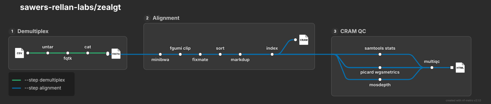

# Structure (proposal)

A guide, not a contract: stages are split, merged or renamed when building and debugging show a better cut. Changes
are recorded here. Terms as in `TERMINOLOGY.md`, decisions in `decisions.md`.

Steps of the built workflows, GENOTYPE in development (source `images/zealgt_metro_full.mmd`, drawn with nf-metro 2.1.0); the README
shows the same map without CRAM QC (`images/zealgt_metro.mmd`).

## Levels

Read top down; each level only names the one below it.

| level    | file                                                  | holds                                         | limit         |
| -------- | ----------------------------------------------------- | --------------------------------------------- | ------------- |
| pipeline | `main.nf`                                             | the `--step` choice and the software versions | template size |
| workflow | `workflows/<name>.nf`                                 | the list of stage calls, MultiQC at the end   | 100 lines     |
| stage    | `subworkflows/local/<stage>/main.nf`                  | one stage's channel wiring                    | 100 lines     |
| tool     | `modules/local/<tool>/main.nf`, `modules/nf-core/...` | one tool call                                 | 100 lines     |
| settings | `conf/*.config`                                       | resources, `ext.args`, publishing; no logic   |               |

- A stage becomes a subworkflow when it chains two or more modules; a single module is called inline.
- Stage names follow nf-core: `<input>_<operation>_<tool>`.
- `subworkflows/local/utils_nfcore_zealgt_pipeline/` keeps the template's code plus the samplesheet-to-channel step,
  nothing else. No Groovy function files.

## DEMULTIPLEX (`--step demultiplex`): library reads to one FASTQ pair per sample

| stage                    | modules                                                                             | status                  |
| ------------------------ | ----------------------------------------------------------------------------------- | ----------------------- |
| `FASTQ_DEMULTIPLEX_FQTK` | `EXTRACT_LANE` -> `FQTK` -> `CAT_FASTQ`; FASTQs and `samplesheets/<input name>.csv` | built (milestones 1, 5) |
| `FASTQ_SEQUALI`          | `SEQUALI` per sample -> `MULTIQC` (read-QC report)                                  | built (milestone 6)     |

## ALIGNMENT (`--step alignment`): per-sample FASTQs to one CRAM per sample

| stage                     | modules                                                                                                                                                                    | status                   |
| ------------------------- | -------------------------------------------------------------------------------------------------------------------------------------------------------------------------- | ------------------------ |
| inline                    | `SEQKIT_HEAD` with `--head N` only (test runs): the first N pairs per sample                                                                                               | built                    |
| `FASTQ_SEQUALI`           | with `--read_qc` only: `SEQUALI` per sample -> `MULTIQC` (read-QC report)                                                                                                  | built (milestone 6)      |
| `FASTQ_ALIGN_MINIBWA`     | `SEQKIT_SPLIT2` -> per chunk `MINIBWA_MAP` -> `FGUMI_CLIP` -> `SAMTOOLS_FIXMATE` -> `SAMTOOLS_SORT`; per sample `SAMTOOLS_MERGE` -> `SAMTOOLS_MARKDUP` -> `SAMTOOLS_INDEX` | built (milestones 2, 2a) |
| `CRAM_QC_SAMTOOLS_PICARD` | `SAMTOOLS_STATS`, `PICARD_COLLECTWGSMETRICS`, `MOSDEPTH`                                                                                                                   | built (milestone 3)      |
| inline                    | `MULTIQC` on the CRAM QC files                                                                                                                                             | built (milestone 4)      |

## GENOTYPE: CRAMs to projected genotypes (development scope: one chromosome end to end)

Input: one CRAM per sample (ALIGNMENT). Output: one VCF per chromosome with every line's genotype, and the ancestry
raster beside it. Each row is a milestone; stage names are provisional (old module names).

| stage                          | modules                                                                                                                                                                                                                                                                                                                 | status              |
| ------------------------------ | ----------------------------------------------------------------------------------------------------------------------------------------------------------------------------------------------------------------------------------------------------------------------------------------------------------------------- | ------------------- |
| `CRAM_VARIANT_DISCOVERY_CRISP` | coverage filter (< 0.05x) -> B73 check filter (`CHECK_COUNTS`, `CHECK_ALT_RATE`) -> witness and B73 check pools (`SAMTOOLS_MERGE`, `SAMTOOLS_ADDREPLACERG`) -> `CRISP` (low-copy BED, an input) -> `BED_CLIP` (CRISP range-end fix) -> `WITNESS_VETO` -> `BCFTOOLS_MPILEUP` (B73 controls) -> `POOLED_LIKELIHOOD_TIERS` | built (milestone 7) |
| `SITES_UNION_GAPFILL`          | `MARKER_UNION` (tier-A sites of all donors: `BCFTOOLS_MERGE` -> `BCFTOOLS_NORM` -> `BIALLELIC_UNION`) -> `COUNT_UNION` (mpileup per BC1 sample and B73 control) -> `UNION_TIERS` -> `FILL_DONOR_ALLELES` (gap filling step 1, Eq. `eb`): each donor's allele at the union                                               | built (milestone 8) |
| `CRAM_ANCESTRY_RTIGER`         | `COUNT_LINES` (mpileup per line at its donor's tier-A sites) -> `CALL_ANCESTRY` (< 2 x rigidity covered markers dropped, rigidity 0.5 % of the donor's tier-A sites; RTIGER) -> `ANCESTRY_GRID` (union on the v5 map, 0.1 cM sweep; R/qtl csvr and ancestry VCF per donor) -> `ANCESTRY_VCF_INDEX`                      | built (milestone 9) |
| `GAP_FILLING_LINES`            | gap filling step 2 (Eq. `step2`): the donor's lines with their ancestry add evidence at the gaps step 1 left missing; ALT only                                                                                                                                                                                          | planned             |
| `GENOTYPE_PROJECTION`          | `RASTERIZE` (segments -> ancestry dosage at the union) -> projection (ancestry x donor allele) -> VCF                                                                                                                                                                                                                   | planned             |

- Union (step 1) and ancestry need only discovery and run side by side; step 2 needs both, and the projection joins
  the ancestry with the step-2 donor alleles. Ancestry uses the donors' own sites only: filled sites never go back
  into RTIGER (one pass).
- Our own tools (Python, R) live in `bin/` and run in a local module each, as nf-core/rnaseq does; the module takes the
  script as a `path` input and calls it through its interpreter (`docs/running.md`: `-resume` and `bin/`).
- No read-start mask (`decisions.md`, 2026-10-04).
- The pilot (Zx.0540_P3, Zx.0570_P2, chr10) is a run plan in `runs/` with a precedent check against zealbc1's results.
- Later, separately: PHG imputation as the comparison method; identity QC (`later/genotype_identity_qc.md`).

## Not built

Store, checkpoints, run guards, registry snapshots, provenance files, cleanup scripts: Nextflow's `-resume`, `work/`,
`publishDir` and `pipeline_info/` do these.
